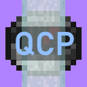

# Quest Compass Plus

Minecraft fabric 1.19.4 mod for the minecraft server Monumenta that adds QOL features related to the quest compass. I'm new to modding so please report any bugs you may encounter.  

  

## Mod Help

For help regarding the mod dm me on discord [.shymike](https://discord.com/users/582648583635992622), for bug reports/ feature requests just use github.

## FAQ

**Q:** Why is the mod for 1.19.4 and not 1.20.1/2?  
**A:** I made the mod for 1.19.4 so it is compatible with [Noelle's Monumenta Modpack](https://modrinth.com/modpack/noelles-monumenta-modpack).

Released under [GPL-3.0](/LICENSE) by [@ImShyMike](https://github.com/ImShyMike).
